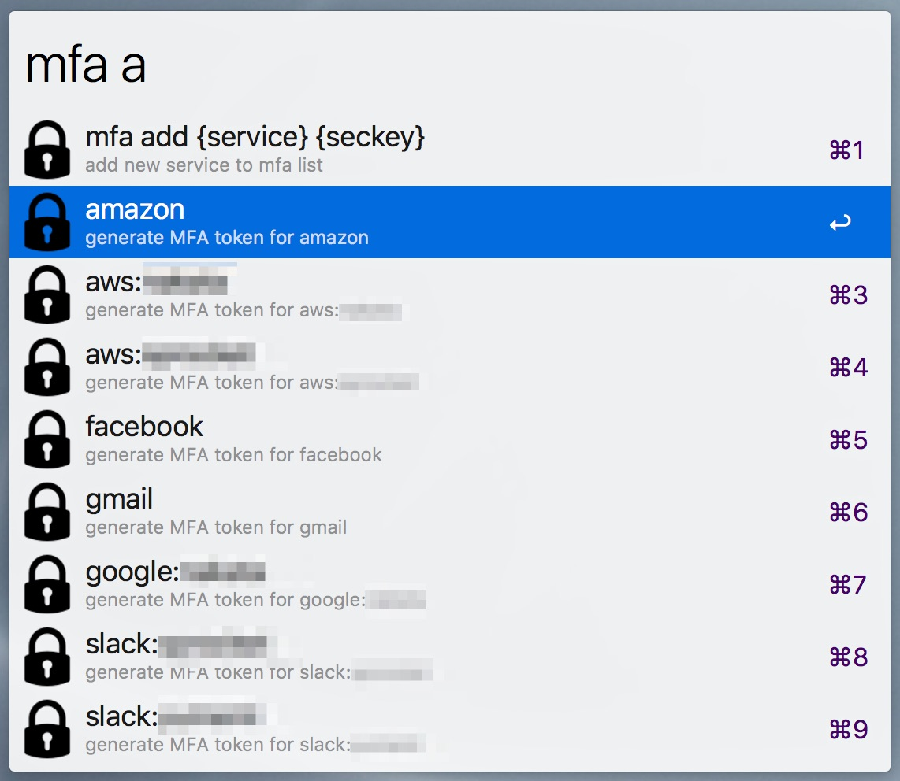
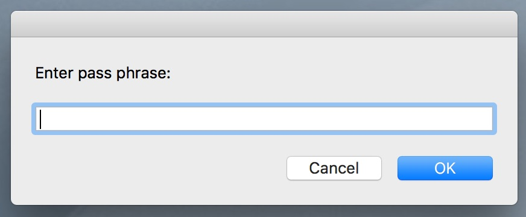
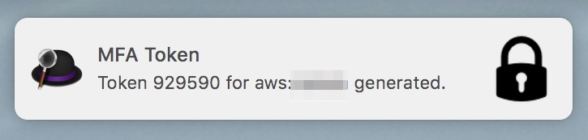
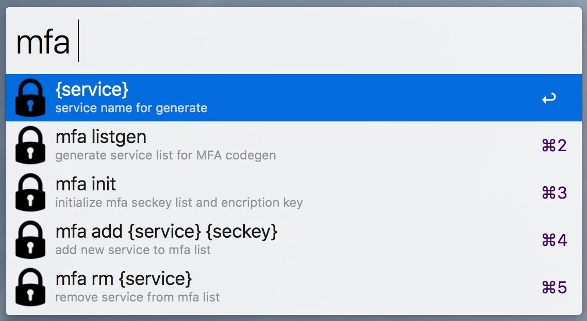

# alfred-mfa-workflow

MFA workflow for [Alfred 3](https://www.alfredapp.com/).

You can easily generate/copy/paste MFA token via Alfred.
Secret key list is encrypted by openssl RSA key.

> You must enter passphrase each time to generate MFA token.

**[DOWNLOAD](https://github.com/u-minor/alfred-mfa-workflow/releases)**







## Prerequisites

This tool uses [oath-toolkit](http://www.nongnu.org/oath-toolkit/) to generate TOTP token.
Please install it from Homebrew.

```
brew install oath-toolkit
```

## How to use

1. Type `mfa init` to initialize openssl encryption key.
2. Type `mfa add SERVICE SECKEY` to add new entry.
3. Type `mfa SERVICE` to generate token for SERVICE.


